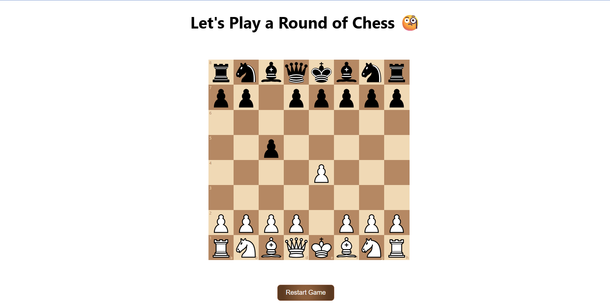

<!DOCTYPE html>
<html lang="en">
<head>
  <meta charset="UTF-8">
  <title>React Chess Game</title>
</head>
<body style="font-family: Arial, sans-serif; line-height: 1.6; max-width: 800px; margin: auto; padding: 20px;">

  <h1>♟️ React Chess Game</h1>

  
Welcome to my interactive Chess Game built with <strong>React</strong>, <strong>chess.js</strong>, and <strong>react-chessboard</strong>!

  
🔗 <strong>Live Demo:</strong> <a href="https://aditya-shukla-professional.github.io/Chess/" target="_blank">Play Now</a>

  

  <h2>🧠 Features</h2>
  <ul>
    <li>✅ Built using <strong>React</strong> with functional components and hooks</li>
    <li>♟️ Chess logic powered by <strong>chess.js</strong></li>
    <li>🎯 Move indicators:
      <ul>
        <li>🔴 Red circle = capturing move</li>
        <li>🟢 Green circle = valid move</li>
        <li>⚪ White highlight = selected piece</li>
      </ul>
    </li>
    <li>👑 Automatic promotion to Queen</li>
    <li>🏆 Game Over detection with winner announcement</li>
    <li>📱 Responsive design that adjusts to screen size</li>
  </ul>

  

  <h2>🚀 How to Run Locally</h2>
  <ol>
    <li><strong>Clone the repository:</strong>
      <pre><code>git clone https://github.com/Aditya-Shukla-Professional/Chess.git
cd Chess</code></pre>
    </li>
    <li><strong>Install dependencies:</strong>
      <pre><code>npm install</code></pre>
    </li>
    <li><strong>Start the app:</strong>
      <pre><code>npm start</code></pre>
    </li>
    <li>Visit <code>http://localhost:3000</code> in your browser</li>
  </ol>

  

  <h2>🛠 Tech Stack</h2>
  <ul>
    <li>React</li>
    <li>chess.js</li>
    <li>react-chessboard</li>
    <li>CSS (Responsive + themed)</li>
  </ul>

  

  <h2>📸 Screenshots</h2>
  

  

  <h2>👨‍💻 Author</h2>
  
<strong>Aditya Shukla</strong>

  
📍 GitHub: <a href="https://github.com/Aditya-Shukla-Professional" target="_blank">@Aditya-Shukla-Professional</a>

  

  <h2>🎮 Play Now</h2>
  
<a href="https://aditya-shukla-professional.github.io/Chess/" target="_blank">Click here to play the game</a>

  
⭐ If you liked this project, please consider starring the repository!

</body>
</html>
